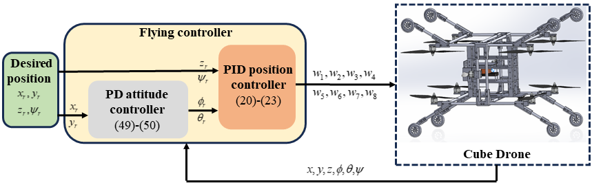
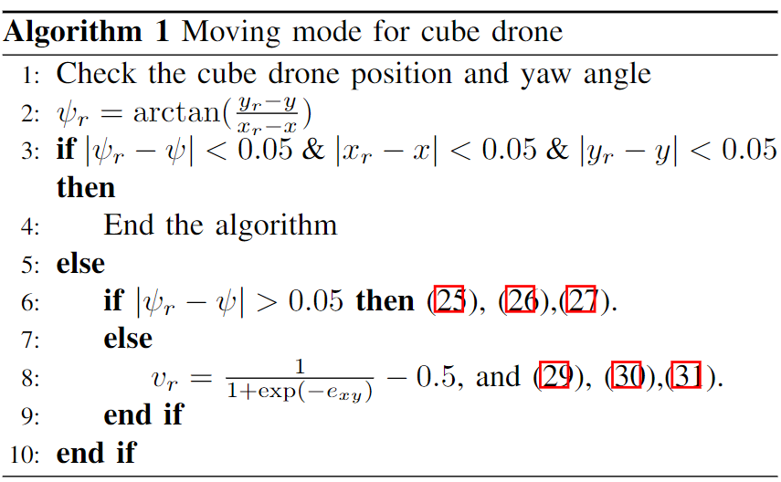
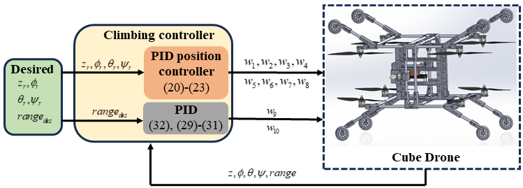

# Cube-Drone ROS Simulation and Custom Controller

This repository contains the ROS simulation and details of the custom controller for the cube-drone. It clarifies the contents of the manuscript: [Cube_drone__ICRA_ARA.pdf](https://github.com/user-attachments/files/16533043/Cube_drone__ICRA_ARA.pdf).

## Software Requirements & Setup

The custom controller is designed in:

- Ubuntu 20.04
- ROS Noetic
- Gazebo 11

Follow these commands to install the package:

```shell
# Step 1: Clone this repo into your workspace
cd ~/catkin_ws/src
git clone --recursive https://github.com/aralab-unr/Custom-controller-for-the-cube-drone.git

# Step 2: Build the workspace using catkin_make
cd ~/catkin_ws
catkin_make

# Step 3: Source the environment variables
source devel/setup.bash
```
# Contents
This section shows how to run the simulation and the results of each **flying**, **running**, and **climbing** mode. The cube-drone parameters are imported from URDF file as:

| Parameter | Value | Parameter | Value |
| --- | --- | --- | --- 
| m | 2.8 $(kg)$ | $k_t$ | $2.5.10^{-4}$ $(N.s^2)$ |
| $I_{xx}$ | 0.0044 $(kg.m^2)$ | $k_d$ | $7.5.10^{-5}$ $(Nm.s^2)$ |
| $I_{yy}$ | 0.0023 $(kg.m^2)$ | $l_x$ | $0.219 (m)$ |
| $I_{zz}$ | 0.0058 $(kg.m^2)$ | $l_y$ | $0.1845 (m)$ |
| Sampling time | 0.05 $(s)$ | 

### a. **Flying mode:**   
An overview of the flying controller framework is shown as follows:
<p align='center'>
    
</p>
Follow these commands in order to run the flying mode:

```
# start ros server
roscore
# start gazebo simulator

# start flying controller

```

https://github.com/user-attachments/assets/a751fc7a-9035-4bb7-8fea-c892e7abaf63

The parameter of the flying controller is as follows:

| Parameter | Value | Parameter | Value |
| --- | --- | --- | --- 
| $k_{px}$ |  | $\text{PID}_z$ | List all new or modified files |
| $k_{px}$ |  | $\text{PID}_{\phi}$ | Show file differences that haven't been staged |
| $k_{px}$ |  | $\text{PID}_{\theta}$ | Show file differences that haven't been staged |
| $k_{px}$ |  | $\text{PID}_{\psi}$ | Show file differences that haven't been staged |

### b. **Moving mode:**   

```
# start ros server
roscore
# start gazebo simulator

# start moving controller

```
<p align='left'>
    
</p>

https://github.com/user-attachments/assets/f47c8db2-a66a-4f89-b168-1131a725187e

| Parameter | Value | Parameter | Value |
| --- | --- | --- | --- 
| $k_{px}$ |  | $PID_z$ | List all new or modified files |
| $k_{px}$ |  | $PID_{\phi}$ | Show file differences that haven't been staged |
| $k_{px}$ |  | $PID_{\theta}$ | Show file differences that haven't been staged |
| $k_{px}$ |  | $PID_{\psi}$ | Show file differences that haven't been staged |

### c. **Climbing mode:**   
An overview of the climbing controller framework is shown as follows:
<p align='center'>
    
</p>

```
# start ros server
roscore
# start gazebo simulator

# start flying controller

```

| Parameter | Value | Parameter | Value |
| --- | --- | --- | --- 
| m | List all new or modified files | $k_t$ | List all new or modified files |
| $I_{xx}$ | Show file differences that haven't been staged | $k_d$ | Show file differences that haven't been staged |
| $I_{yy}$ | Show file differences that haven't been staged | $l_x$ | Show file differences that haven't been staged |
| $I_{zz}$ | Show file differences that haven't been staged | $l_y$ | Show file differences that haven't been staged |


https://github.com/user-attachments/assets/c17747fc-f272-4769-bdf9-9989708ab5bc

